# B3-1 내가 만든 웹사이트를 인터넷에 올려 누구나 쓰게 하기

AWS 서울 리전에 VPC로 격리된 네트워크를 구성하고, 퍼블릭 서브넷에 배치한 EC2 인스턴스에 웹 서버를 올려 외부에서 접속 가능한 상태로 만듭니다. 보안 그룹 인바운드는 필요한 포트만 열고, 실습에는 EC2와 VPC 구성에 필요한 범위로 권한을 제한한 IAM 사용자를 사용합니다.

외부 접속 검증은 (A) 브라우저에서 `http://<퍼블릭IP>`로 접속하는 방식을 선택했습니다.

## 실행 환경

리소스는 AWS 관리 콘솔에서 만들었고, 인스턴스 안의 작업은 로컬 터미널에서 SSH로 접속해 진행했습니다.

```bash
$ sw_vers
ProductName:		macOS
ProductVersion:		15.7.7
BuildVersion:		24G720
$ ssh -V
OpenSSH_9.9p2, LibreSSL 3.3.6
```

모든 리소스는 서울 리전(ap-northeast-2)에 만들었습니다. 아래 화면과 명령 출력에서 작업에 사용한 회선의 공인 IP는 가렸습니다.

## IAM 사용자와 권한

실습 전용 IAM 사용자 `b3-1-practice`를 만들고, EC2와 VPC 구성에 필요한 액션만 허용한 정책을 직접 연결했습니다. 루트 계정은 이 사용자를 만들 때만 사용했고, 콘솔 작업은 전부 이 사용자로 로그인해서 했습니다. 아래 모든 화면의 오른쪽 위에 로그인한 사용자 이름이 보입니다.

연결한 정책입니다.

```json
{
  "Version": "2012-10-17",
  "Statement": [
    {
      "Sid": "Ec2ReadOnly",
      "Effect": "Allow",
      "Action": "ec2:Describe*",
      "Resource": "*"
    },
    {
      "Sid": "Ec2NetworkAndInstanceManage",
      "Effect": "Allow",
      "Action": [
        "ec2:CreateVpc",
        "ec2:DeleteVpc",
        "ec2:ModifyVpcAttribute",
        "ec2:CreateSubnet",
        "ec2:DeleteSubnet",
        "ec2:ModifySubnetAttribute",
        "ec2:CreateInternetGateway",
        "ec2:DeleteInternetGateway",
        "ec2:AttachInternetGateway",
        "ec2:DetachInternetGateway",
        "ec2:CreateRouteTable",
        "ec2:DeleteRouteTable",
        "ec2:CreateRoute",
        "ec2:DeleteRoute",
        "ec2:AssociateRouteTable",
        "ec2:DisassociateRouteTable",
        "ec2:CreateSecurityGroup",
        "ec2:DeleteSecurityGroup",
        "ec2:AuthorizeSecurityGroupIngress",
        "ec2:AuthorizeSecurityGroupEgress",
        "ec2:RevokeSecurityGroupIngress",
        "ec2:RevokeSecurityGroupEgress",
        "ec2:RunInstances",
        "ec2:TerminateInstances",
        "ec2:StartInstances",
        "ec2:StopInstances",
        "ec2:CreateKeyPair",
        "ec2:DeleteKeyPair",
        "ec2:ImportKeyPair",
        "ec2:CreateTags",
        "ec2:DeleteTags",
        "ec2:CreateVolume",
        "ec2:DeleteVolume",
        "ec2:AttachVolume",
        "ec2:DetachVolume"
      ],
      "Resource": "*",
      "Condition": {
        "StringEquals": {
          "aws:RequestedRegion": "ap-northeast-2"
        }
      }
    }
  ]
}
```

조회용 `ec2:Describe*` 외의 액션은 `aws:RequestedRegion` 조건으로 서울 리전에서만 허용됩니다. EC2의 생성 계열 액션은 대부분 리소스 ARN 단위 제한을 지원하지 않기 때문에, 서비스와 액션 목록에 리전 조건을 더하는 방식으로 범위를 좁혔습니다. S3, RDS 같은 실습과 무관한 서비스와 IAM 조작 권한은 넣지 않았고 AdministratorAccess도 연결하지 않았습니다.

권한을 좁게 잡은 결과는 작업 중에 그대로 드러납니다. 인스턴스 시작 화면에서 보안 그룹을 고르면 콘솔이 `ec2:GetSecurityGroupsForVpc`로 규칙을 검증하려다 권한이 없다는 경고를 띄웁니다. 인스턴스 시작 자체에는 필요 없는 조회라 권한을 넓히지 않고 그대로 진행했습니다. 이 판단 과정은 [트러블슈팅 보고서](docs/troubleshooting.md)에 정리했습니다.

## 네트워크 구성

VPC 대역은 10.0.0.0/16으로 잡고 이름 태그를 `b3-1-vpc`로 붙였습니다. 리소스마다 `b3-1-` 접두사를 붙여 나중에 목록에서 골라낼 수 있게 했습니다.

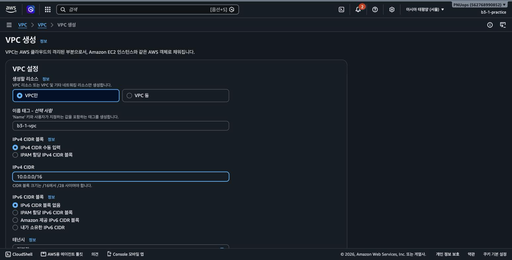

생성된 VPC입니다.

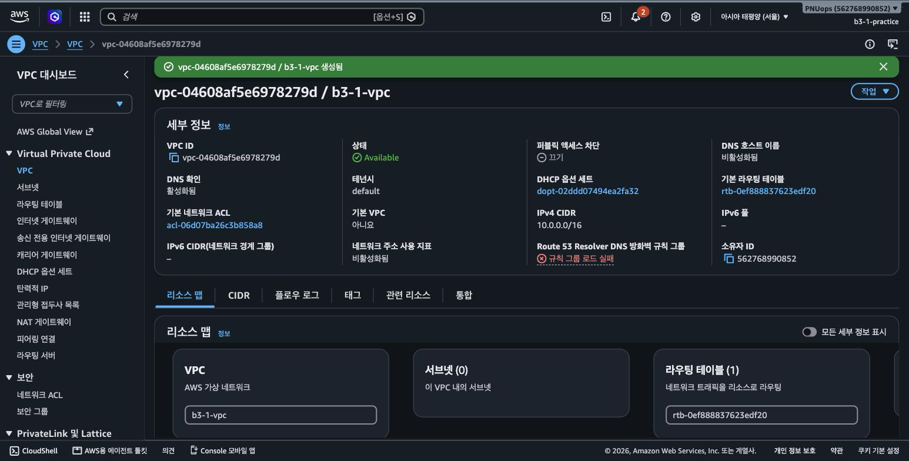

서브넷은 VPC 대역 안에서 10.0.1.0/24를 잘라 가용 영역 ap-northeast-2a에 만들었습니다. 만든 직후에는 이 서브넷에서 시작하는 인스턴스에 퍼블릭 IP가 붙지 않으므로, 서브넷 설정에서 퍼블릭 IPv4 주소 자동 할당을 켰습니다.

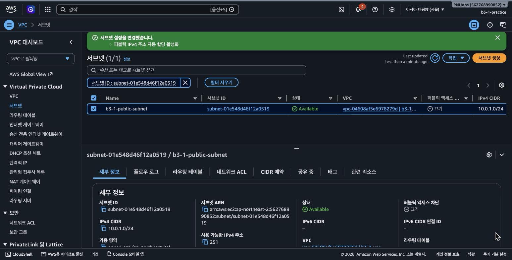

인터넷 게이트웨이를 만들고 VPC에 연결했습니다. 연결 전에는 상태가 Detached이고, 연결하면 Attached로 바뀝니다.

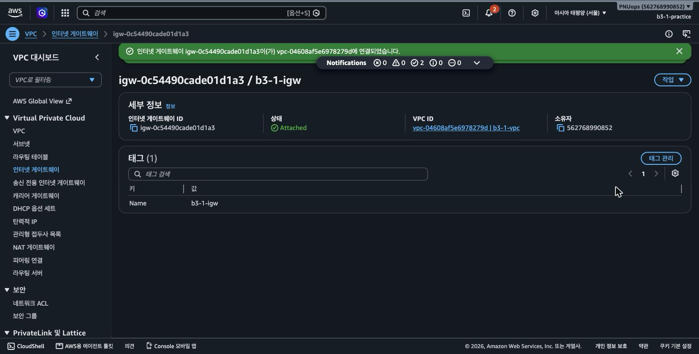

라우팅 테이블을 만들어 0.0.0.0/0 경로를 인터넷 게이트웨이로 향하게 하고, 서브넷에 연결했습니다.

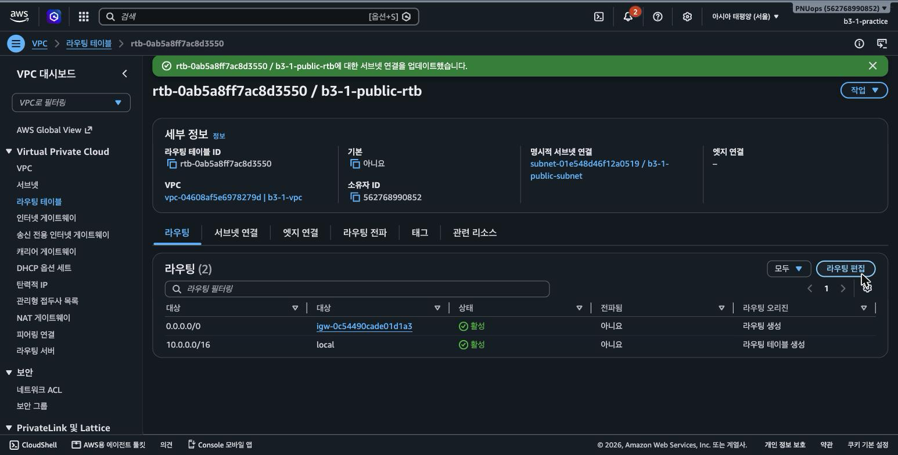

10.0.0.0/16의 local 경로는 VPC를 만들 때 자동으로 생기며 VPC 내부 통신을 처리합니다. 여기에 더한 0.0.0.0/0 경로가 인터넷 게이트웨이를 향하기 때문에, 이 서브넷에 있는 인스턴스는 VPC 대역에 속하지 않는 주소로 나가는 트래픽을 게이트웨이로 보냅니다. 이 경로가 없으면 인스턴스에 퍼블릭 IP가 있어도 외부와 통신하지 못합니다. 라우팅 테이블은 서브넷에 연결해야 적용되므로 명시적 서브넷 연결까지 확인했습니다.

## 보안 그룹

인바운드는 두 개만 열었습니다. HTTP(80)는 누구나 접속해야 하므로 0.0.0.0/0에서 받고, SSH(22)는 소스를 "내 IP"로 지정해 작업 회선의 주소 하나(/32)만 허용했습니다.

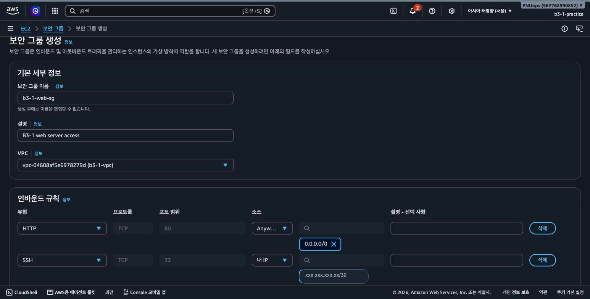

생성된 보안 그룹입니다. 인바운드 규칙은 SSH와 HTTP 두 건뿐입니다.

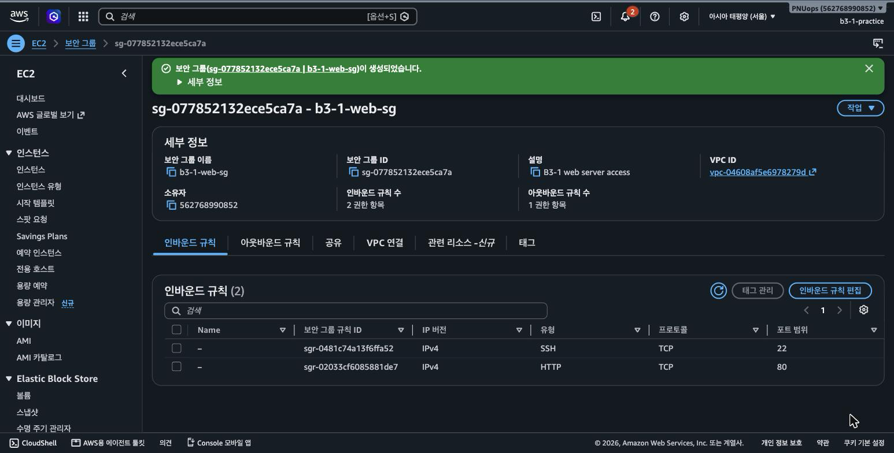

전체 포트를 여는 규칙이나 22번을 0.0.0.0/0으로 여는 규칙은 만들지 않았습니다. SSH는 서버를 다루는 통로라 열려 있으면 곧바로 비밀번호 대입 시도가 들어옵니다. 반면 HTTP는 서비스 자체가 불특정 다수를 받아야 하므로 열어둘 수밖에 없고, 대신 그 뒤에 있는 웹 서버만 노출됩니다.

## 인스턴스 생성

OS는 Ubuntu, 인스턴스 유형은 프리 티어 대상인 t3.micro, 스토리지는 기본값인 8GiB gp3을 사용했습니다. 키 페어 `b3-1-key`를 만들어 개인키 파일을 내려받았고, 네트워크는 앞에서 만든 VPC와 서브넷, 보안 그룹을 지정했습니다. 퍼블릭 IP 자동 할당은 서브넷 설정을 따라 활성화 상태입니다.

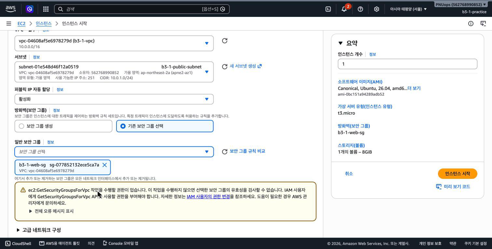

시작된 인스턴스입니다. 퍼블릭 IP 43.201.49.58, 프라이빗 IP 10.0.1.170을 받았습니다.

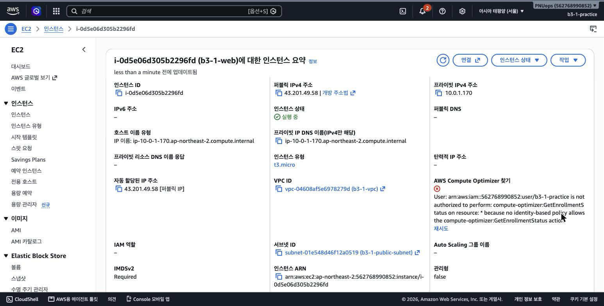

프라이빗 IP는 서브넷 대역 10.0.1.0/24 안에서 받은 주소이고, 퍼블릭 IP는 서브넷 속성을 켜둔 덕분에 자동으로 붙었습니다.

## SSH 접속과 웹 서버 배포

내려받은 키 파일의 권한을 좁히고 접속했습니다. 보안 그룹에 등록한 주소에서 들어오므로 접속이 됩니다.

```bash
$ chmod 400 b3-1-key.pem
$ ssh -i b3-1-key.pem ubuntu@43.201.49.58 'hostname; . /etc/os-release && echo $PRETTY_NAME'
ip-10-0-1-170
Ubuntu 26.04 LTS
```

인스턴스에서 바깥으로 나가는 통신도 확인했습니다. 라우팅 테이블의 0.0.0.0/0 경로와 인터넷 게이트웨이가 동작하고 있다는 뜻입니다.

```bash
$ ssh -i b3-1-key.pem ubuntu@43.201.49.58 'curl -sS -I https://example.com | head -1'
HTTP/2 200
```

nginx를 설치했습니다.

```bash
$ ssh -i b3-1-key.pem ubuntu@43.201.49.58 'sudo apt-get update -qq && sudo apt-get install -y -qq nginx; nginx -v; systemctl is-active nginx'
nginx version: nginx/1.28.3 (Ubuntu)
active
```

헬스체크용 경로도 함께 두기 위해 기본 사이트 설정에 `/health`를 추가했습니다. 정확히 일치하는 경로만 받도록 `=`를 붙였고 응답은 고정 문자열입니다.

```bash
$ ssh -i b3-1-key.pem ubuntu@43.201.49.58 'cat /etc/nginx/sites-available/default'
server {
    listen 80 default_server;

    root /var/www/html;
    index index.nginx-debian.html;

    location = /health {
        default_type text/plain;
        return 200 'OK';
    }
}
$ ssh -i b3-1-key.pem ubuntu@43.201.49.58 'sudo nginx -t && sudo systemctl reload nginx'
nginx: the configuration file /etc/nginx/nginx.conf syntax is ok
nginx: configuration file /etc/nginx/nginx.conf test is successful
```

인스턴스 안에서 자기 자신에게 요청하면 200이 돌아옵니다. 여기까지는 보안 그룹과 무관하게 서버 프로세스가 살아 있는지만 확인하는 단계입니다.

```bash
$ ssh -i b3-1-key.pem ubuntu@43.201.49.58 'curl -sS -o /dev/null -w "localhost:%{http_code}\n" http://localhost; curl -sS http://localhost/health'
localhost:200
OK
```

## 구성도


외부 요청은 인터넷 게이트웨이를 통해 VPC로 들어옵니다. 라우팅 테이블이 목적지를 보고 전달할 곳을 정하고, 퍼블릭 서브넷에 있는 인스턴스 앞에서 보안 그룹이 포트를 판단합니다. 80번이면 통과해 nginx가 응답하고, 22번은 등록된 주소에서 온 것만 통과합니다. 인스턴스가 밖으로 나가는 트래픽도 같은 경로를 거꾸로 지나갑니다.

## 외부 접속 확인

검증 방식은 (A) 브라우저 접속을 선택했습니다. 접속 주소는 `http://43.201.49.58`입니다. 웹 서버를 설치한 상태 그대로 확인할 수 있어 서버에 손댈 부분이 없기 때문입니다.

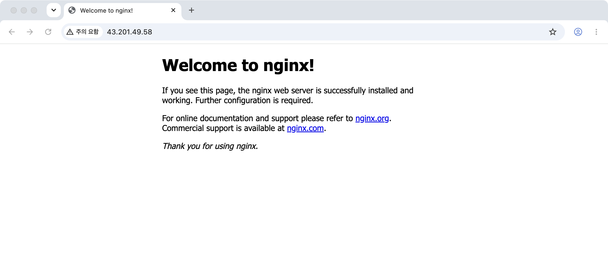

같은 주소를 로컬 터미널에서 요청해도 200이 돌아옵니다.

```bash
$ curl -sS -o /dev/null -w "%{http_code}\n" http://43.201.49.58
200
```

(B) 방식인 헬스체크 경로도 함께 확인했습니다. 응답 코드와 본문이 고정되어 감시 도구가 판정하기 쉽다는 점이 브라우저 방식과 다릅니다.

```bash
$ curl -sS -D - http://43.201.49.58/health
HTTP/1.1 200 OK
Server: nginx/1.28.3 (Ubuntu)
Date: Sat, 19 Sep 2026 02:49:15 GMT
Content-Type: text/plain
Content-Length: 2
Connection: keep-alive

OK
```

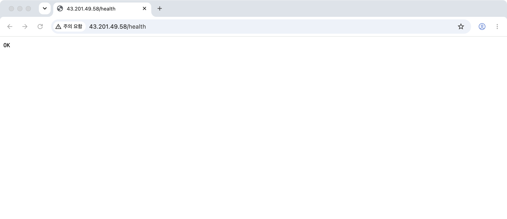

구성 중 겪은 문제와 원인을 좁힌 과정은 [트러블슈팅 보고서](docs/troubleshooting.md)에 정리했습니다.

## 개념 정리

### VPC, 서브넷, 라우팅 테이블, 인터넷 게이트웨이

VPC는 계정 안에 만드는 격리된 네트워크이고, 생성할 때 정한 사설 대역(여기서는 10.0.0.0/16) 안에서만 주소를 나눠 줍니다. 서브넷은 그 대역을 잘라 가용 영역 하나에 배치하는 구획이며, 인스턴스는 항상 특정 서브넷에 들어갑니다. 라우팅 테이블은 그 서브넷에서 나가는 패킷을 목적지 대역별로 어디에 넘길지 정하고, 인터넷 게이트웨이는 VPC와 인터넷 사이의 출입구 역할을 하며 퍼블릭 IP와 프라이빗 IP 사이의 주소 변환을 담당합니다.

퍼블릭 서브넷이라는 별도의 리소스 종류가 있는 것은 아닙니다. 연결된 라우팅 테이블에 0.0.0.0/0 경로가 인터넷 게이트웨이로 향하는 서브넷을 퍼블릭 서브넷이라고 부릅니다.

### Security Group과 IAM의 차이

Security Group은 인스턴스 앞에 붙는 가상 방화벽으로, 어떤 출발지에서 어떤 포트로 들어오는 트래픽을 받을지 판단합니다. IAM은 AWS API를 호출할 권한, 즉 누가 어떤 리소스를 만들고 지울 수 있는지를 판단합니다. 판단하는 대상이 트래픽과 API 호출로 다르기 때문에 한쪽을 조인다고 다른 쪽이 대체되지 않습니다. IAM 권한이 아무리 좁아도 보안 그룹이 22번을 전체 공개로 열어두면 서버는 그대로 노출되고, 반대로 보안 그룹을 잘 잠가도 IAM 권한이 넓으면 자격증명이 새는 순간 리소스를 마음대로 만들 수 있습니다.

최소 권한을 적용하는 이유는 사고가 났을 때 피해 범위를 권한 범위로 묶어두기 위해서입니다. 권한이 부족해 작업이 막히면 오류 메시지에 찍힌 액션 이름 하나만 정책에 추가하는 방식으로 필요한 범위를 찾아갑니다. 막힐 때마다 `ec2:*`나 관리자 정책으로 한 번에 넘기면 왜 그 권한이 필요한지 알 수 없게 되고, 실습이 끝난 뒤에도 넓은 권한이 그대로 남습니다.

### 외부 요청이 웹 서버에 도달하기까지

브라우저가 퍼블릭 IP로 요청을 보내면 네 가지가 모두 맞아야 응답이 돌아옵니다. 인스턴스에 퍼블릭 IP가 붙어 있어야 하고, 라우팅 테이블에 인터넷 게이트웨이로 향하는 경로가 있어야 하며, 보안 그룹이 80번을 허용해야 하고, 인스턴스 안에서 웹 서버가 80번을 열고 있어야 합니다. 이 중 하나만 빠져도 증상은 대부분 똑같이 "응답 없음"으로 보이기 때문에, 확인은 바깥쪽에서 안쪽으로 순서대로 좁혀야 합니다.

### 과금이 발생하는 지점

EC2는 인스턴스가 실행 중인 시간만큼, EBS 볼륨은 인스턴스를 정지해도 볼륨이 남아 있는 동안 계속 과금됩니다. Elastic IP는 인스턴스에 연결되어 있으면 무료지만 할당만 해두고 붙이지 않으면 요금이 붙고, NAT Gateway나 로드밸런서는 존재하는 것만으로 시간당 요금이 발생합니다. 이번 실습에서는 Elastic IP와 NAT Gateway를 만들지 않고 인스턴스에 자동 할당된 퍼블릭 IP를 사용했습니다.

예상하지 못한 금액이 청구되면 Cost Explorer에서 서비스별로 나눠 보고, 어느 리소스인지까지 좁힐 때는 비용 할당 태그를 켜둔 상태에서 태그 단위로 봅니다. 이번처럼 이름에 공통 접두사를 붙여두면 그 단위로 묶어서 확인할 수 있습니다. 반복해서 새는 항목은 대체로 지우지 않은 EBS 볼륨, 인스턴스에서 분리된 Elastic IP, 만들어두고 잊은 NAT Gateway와 로드밸런서입니다. Budgets에 금액 알림을 걸어두면 청구서를 받기 전에 알 수 있습니다.

### 트래픽이 늘어날 때의 병목

지금 구성은 인스턴스 한 대가 퍼블릭 IP를 직접 받아 서비스합니다. 트래픽이 늘면 그 한 대의 CPU와 nginx의 동시 연결 수가 먼저 한계에 도달하고, 인스턴스가 재시작되거나 중단되는 순간 서비스 전체가 멈춥니다. 대수를 늘리려 해도 퍼블릭 IP가 인스턴스에 직접 붙어 있어서 요청을 나눌 지점이 없습니다.

두 대 이상으로 늘리려면 앞에 Application Load Balancer를 두고 인스턴스들을 대상 그룹으로 묶습니다. 로드밸런서는 서로 다른 가용 영역에 서브넷이 하나씩 필요하므로 지금의 단일 서브넷 구성에 서브넷을 하나 더 만들어야 하고, 보안 그룹도 80번을 로드밸런서에서만 받도록 바꿔 인스턴스가 직접 노출되지 않게 합니다. 세션이나 업로드 파일처럼 인스턴스 안에 쌓이는 상태가 있으면 어느 대에 붙느냐에 따라 결과가 달라지므로, 그 상태를 밖으로 빼는 작업이 대수를 늘리기 전에 선행되어야 합니다.

## 보너스: Docker 컨테이너로 웹 서비스 배포

같은 인스턴스에 Docker를 설치하고, 패키지로 설치한 nginx 대신 컨테이너가 80번을 서비스하도록 바꿨습니다.

```bash
$ ssh -i b3-1-key.pem ubuntu@43.201.49.58 'sudo apt-get install -y -qq docker.io; docker --version; sudo systemctl is-active docker'
Docker version 29.1.3, build 29.1.3-0ubuntu4.1
active
```

컨테이너가 호스트의 80번을 받아야 하므로 패키지로 설치한 nginx를 먼저 내렸습니다. 이미지는 공개 이미지 `nginx:alpine`을 사용하고, 서비스할 페이지와 nginx 설정을 컨테이너 안에 읽기 전용으로 마운트했습니다. 설정에는 앞에서와 같은 `/health` 경로를 넣어 컨테이너로 바꾼 뒤에도 같은 방식으로 확인할 수 있게 했습니다.

```bash
$ scp -i b3-1-key.pem app/index.html ubuntu@43.201.49.58:/home/ubuntu/index.html
$ ssh -i b3-1-key.pem ubuntu@43.201.49.58 'sudo systemctl stop nginx && sudo systemctl disable nginx'
$ ssh -i b3-1-key.pem ubuntu@43.201.49.58 'sudo docker run -d --name web -p 80:80 -v /home/ubuntu/index.html:/usr/share/nginx/html/index.html:ro -v /home/ubuntu/default.conf:/etc/nginx/conf.d/default.conf:ro nginx:alpine'
e165bbb6e980349f4364a6acb889bf7c8a8619e8d1615d50f286c9943aa80c74
```

실행한 이미지는 `nginx:alpine`, 컨테이너 이름은 `web`, 포트 매핑은 호스트 80번을 컨테이너 80번에 연결한 `-p 80:80`입니다.

```bash
$ ssh -i b3-1-key.pem ubuntu@43.201.49.58 'sudo docker ps'
CONTAINER ID   IMAGE          COMMAND                  CREATED          STATUS         PORTS                                 NAMES
e165bbb6e980   nginx:alpine   "/docker-entrypoint.…"   31 seconds ago   Up 30 seconds  0.0.0.0:80->80/tcp, [::]:80->80/tcp   web
```

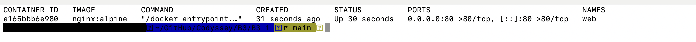

인스턴스 안에서 요청하면 200이 돌아옵니다. 응답 헤더의 서버 버전이 패키지로 설치했던 nginx/1.28.3이 아니라 이미지에 들어 있는 nginx/1.31.6이므로, 응답을 돌려주는 주체가 컨테이너임을 알 수 있습니다.

```bash
$ ssh -i b3-1-key.pem ubuntu@43.201.49.58 'curl -sS -o /dev/null -w "localhost:%{http_code}\n" http://localhost; curl -sS -I http://localhost | head -2; curl -sS http://localhost/health'
localhost:200
HTTP/1.1 200 OK
Server: nginx/1.31.6
OK
```

외부에서 브라우저로 접속하면 컨테이너가 서비스하는 페이지가 보입니다.

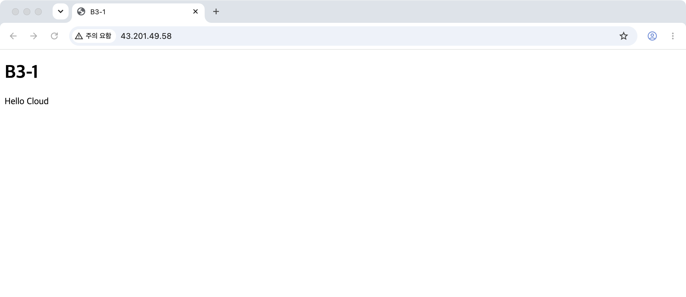

## 리소스 정리

실습을 마친 뒤 만든 리소스를 모두 삭제했습니다. EC2 인스턴스는 종료했고 루트 EBS 볼륨은 종료와 함께 사라졌습니다. VPC를 지우면서 서브넷, 라우팅 테이블, 인터넷 게이트웨이, 보안 그룹이 함께 삭제됐고 키 페어도 지웠습니다. Elastic IP와 NAT Gateway는 만들지 않았습니다.

삭제 화면과 남은 리소스 확인 결과는 [리소스 정리 체크리스트](docs/cleanup-checklist.md)에 있습니다.
