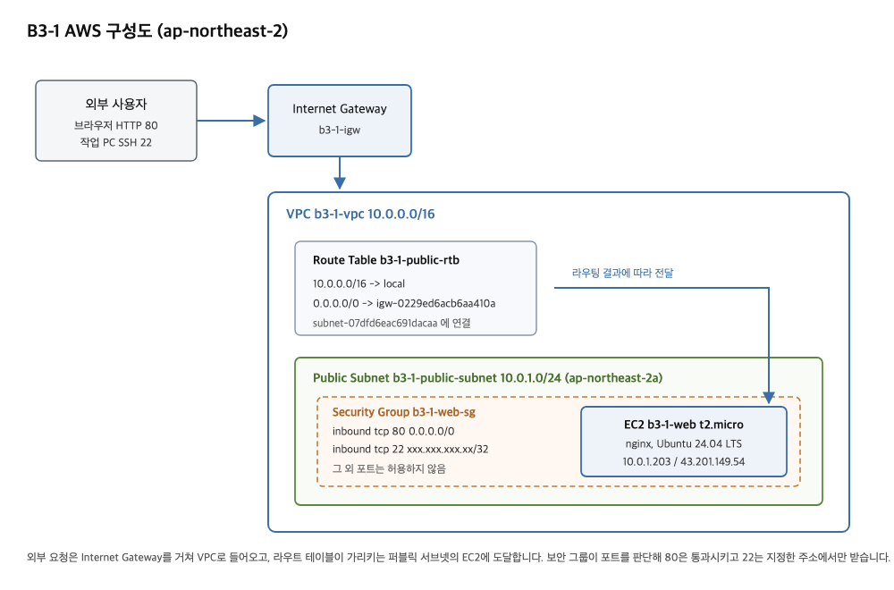

# B3-1 내가 만든 웹사이트를 인터넷에 올려 누구나 쓰게 하기

AWS 서울 리전에 VPC로 격리된 네트워크를 구성하고, 퍼블릭 서브넷에 배치한 EC2 인스턴스에 웹 서버를 올려 외부에서 접속 가능한 상태로 만듭니다. 보안 그룹 인바운드는 필요한 포트만 열고, 실습에는 EC2/VPC 구성에 필요한 범위로 권한을 제한한 IAM 사용자를 사용합니다.

외부 접속 검증은 (A) 브라우저에서 `http://<퍼블릭IP>`로 접속하는 방식을 선택했습니다.

## 실행 환경

로컬에서 AWS CLI로 리소스를 생성하고, SSH로 인스턴스에 접속해 웹 서버를 설치했습니다.

```bash
$ sw_vers
ProductName:		macOS
ProductVersion:		15.7.7
BuildVersion:		24G720
$ aws --version
aws-cli/2.36.47 Python/3.14.7 Darwin/24.6.0 source/arm64
$ ssh -V
OpenSSH_9.9p2, LibreSSL 3.3.6
```

모든 리소스는 서울 리전(ap-northeast-2)에 만들었습니다. 아래 명령 출력에서 AWS 계정 ID와 작업에 사용한 회선의 공인 IP는 가렸습니다.

## IAM 사용자와 권한

실습 전용 IAM 사용자 `b3-1-practice`를 만들고, EC2와 VPC 구성에 필요한 액션만 허용한 정책을 직접 연결했습니다. 루트 계정은 이 사용자를 만들 때만 사용했고, 이후 모든 명령은 이 사용자의 액세스 키를 등록한 프로필로 실행했습니다.

```bash
$ export AWS_PROFILE=codyssey-b3-1
$ aws sts get-caller-identity
{
    "UserId": "AIDAYGB5FKKCKVE3I6QMJ",
    "Account": "************",
    "Arn": "arn:aws:iam::************:user/b3-1-practice"
}
```

연결한 정책은 다음과 같습니다.

```json
{
  "Version": "2012-10-17",
  "Statement": [
    {
      "Sid": "Ec2ReadOnly",
      "Effect": "Allow",
      "Action": "ec2:Describe*",
      "Resource": "*"
    },
    {
      "Sid": "Ec2NetworkAndInstanceManage",
      "Effect": "Allow",
      "Action": [
        "ec2:CreateVpc",
        "ec2:DeleteVpc",
        "ec2:ModifyVpcAttribute",
        "ec2:CreateSubnet",
        "ec2:DeleteSubnet",
        "ec2:ModifySubnetAttribute",
        "ec2:CreateInternetGateway",
        "ec2:DeleteInternetGateway",
        "ec2:AttachInternetGateway",
        "ec2:DetachInternetGateway",
        "ec2:CreateRouteTable",
        "ec2:DeleteRouteTable",
        "ec2:CreateRoute",
        "ec2:DeleteRoute",
        "ec2:AssociateRouteTable",
        "ec2:DisassociateRouteTable",
        "ec2:CreateSecurityGroup",
        "ec2:DeleteSecurityGroup",
        "ec2:AuthorizeSecurityGroupIngress",
        "ec2:AuthorizeSecurityGroupEgress",
        "ec2:RevokeSecurityGroupIngress",
        "ec2:RevokeSecurityGroupEgress",
        "ec2:RunInstances",
        "ec2:TerminateInstances",
        "ec2:StartInstances",
        "ec2:StopInstances",
        "ec2:CreateKeyPair",
        "ec2:DeleteKeyPair",
        "ec2:ImportKeyPair",
        "ec2:CreateTags",
        "ec2:DeleteTags",
        "ec2:CreateVolume",
        "ec2:DeleteVolume",
        "ec2:AttachVolume",
        "ec2:DetachVolume"
      ],
      "Resource": "*",
      "Condition": {
        "StringEquals": {
          "aws:RequestedRegion": "ap-northeast-2"
        }
      }
    }
  ]
}
```

조회용 `ec2:Describe*` 외의 액션은 `aws:RequestedRegion` 조건으로 서울 리전에서만 허용됩니다. EC2의 생성 계열 액션은 대부분 리소스 ARN 단위 제한을 지원하지 않기 때문에, 서비스와 액션 목록에 리전 조건을 더하는 방식으로 범위를 좁혔습니다. S3, RDS 같은 실습과 무관한 서비스와 IAM 조작 권한은 넣지 않았고 AdministratorAccess도 연결하지 않았습니다.

실제로 이 사용자로는 자신에게 연결된 정책조차 조회할 수 없습니다.

```bash
$ aws iam list-attached-user-policies --user-name b3-1-practice

aws: [ERROR]: An error occurred (AccessDenied) when calling the ListAttachedUserPolicies operation: User: arn:aws:iam::************:user/b3-1-practice is not authorized to perform: iam:ListAttachedUserPolicies on resource: user b3-1-practice because no identity-based policy allows the iam:ListAttachedUserPolicies action.
```

## 네트워크 구성

VPC, 퍼블릭 서브넷, 인터넷 게이트웨이, 라우트 테이블을 차례로 만들었습니다. 모든 리소스에는 `b3-1-` 접두사를 붙인 Name 태그를 달아 나중에 목록에서 골라낼 수 있게 했습니다.

```bash
$ aws ec2 create-vpc --cidr-block 10.0.0.0/16 \
    --tag-specifications 'ResourceType=vpc,Tags=[{Key=Name,Value=b3-1-vpc}]' \
    --query 'Vpc.{VpcId:VpcId,CidrBlock:CidrBlock,State:State}'
{
    "VpcId": "vpc-03eae37b07d72dc9f",
    "CidrBlock": "10.0.0.0/16",
    "State": "pending"
}
```

서브넷은 VPC 대역 10.0.0.0/16 안에서 10.0.1.0/24를 잘라 가용 영역 ap-northeast-2a에 만들었습니다.

```bash
$ aws ec2 create-subnet --vpc-id vpc-03eae37b07d72dc9f --cidr-block 10.0.1.0/24 \
    --availability-zone ap-northeast-2a \
    --tag-specifications 'ResourceType=subnet,Tags=[{Key=Name,Value=b3-1-public-subnet}]' \
    --query 'Subnet.{SubnetId:SubnetId,CidrBlock:CidrBlock,AvailabilityZone:AvailabilityZone,MapPublicIpOnLaunch:MapPublicIpOnLaunch}'
{
    "SubnetId": "subnet-07dfd6eac691dacaa",
    "CidrBlock": "10.0.1.0/24",
    "AvailabilityZone": "ap-northeast-2a",
    "MapPublicIpOnLaunch": false
}
```

`MapPublicIpOnLaunch`가 false이면 이 서브넷에서 만든 인스턴스에 퍼블릭 IP가 붙지 않습니다. 서브넷 속성을 켜서 이후 생성하는 인스턴스가 자동으로 퍼블릭 IP를 받도록 했습니다.

```bash
$ aws ec2 modify-subnet-attribute --subnet-id subnet-07dfd6eac691dacaa --map-public-ip-on-launch
$ aws ec2 describe-subnets --subnet-ids subnet-07dfd6eac691dacaa --query 'Subnets[0].MapPublicIpOnLaunch'
true
```

인터넷 게이트웨이를 만들어 VPC에 연결했습니다. 연결 명령은 성공하면 출력이 없습니다.

```bash
$ aws ec2 create-internet-gateway \
    --tag-specifications 'ResourceType=internet-gateway,Tags=[{Key=Name,Value=b3-1-igw}]' \
    --query 'InternetGateway.InternetGatewayId' --output text
igw-0229ed6acb6aa410a
$ aws ec2 attach-internet-gateway --internet-gateway-id igw-0229ed6acb6aa410a --vpc-id vpc-03eae37b07d72dc9f
```

라우트 테이블을 만들고 기본 경로를 인터넷 게이트웨이로 향하게 한 뒤 서브넷에 연결했습니다.

```bash
$ aws ec2 create-route-table --vpc-id vpc-03eae37b07d72dc9f \
    --tag-specifications 'ResourceType=route-table,Tags=[{Key=Name,Value=b3-1-public-rtb}]' \
    --query 'RouteTable.RouteTableId' --output text
rtb-0f3a3f86b4e749e9d
$ aws ec2 create-route --route-table-id rtb-0f3a3f86b4e749e9d --destination-cidr-block 0.0.0.0/0 --gateway-id igw-0229ed6acb6aa410a
{
    "Return": true
}
$ aws ec2 associate-route-table --route-table-id rtb-0f3a3f86b4e749e9d --subnet-id subnet-07dfd6eac691dacaa --query 'AssociationId' --output text
rtbassoc-0f2fb76bb65cb0765
```

구성한 라우트 테이블의 경로와 연결 상태입니다.

```bash
$ aws ec2 describe-route-tables --route-table-ids rtb-0f3a3f86b4e749e9d \
    --query 'RouteTables[0].{Routes:Routes[].{Destination:DestinationCidrBlock,Target:join(``,[GatewayId]),State:State},Subnet:Associations[0].SubnetId}'
{
    "Routes": [
        {
            "Destination": "10.0.0.0/16",
            "Target": "local",
            "State": "active"
        },
        {
            "Destination": "0.0.0.0/0",
            "Target": "igw-0229ed6acb6aa410a",
            "State": "active"
        }
    ],
    "Subnet": "subnet-07dfd6eac691dacaa"
}
```

local 경로는 VPC를 만들 때 자동으로 생기며 VPC 내부 통신을 처리합니다. 여기에 더한 0.0.0.0/0 경로가 인터넷 게이트웨이를 향하기 때문에, 이 서브넷에 있는 인스턴스는 VPC 대역에 속하지 않는 주소로 나가는 트래픽을 게이트웨이로 보냅니다. 이 경로가 없으면 인스턴스에 퍼블릭 IP가 있어도 외부와 통신하지 못합니다.

## 보안 그룹

인바운드는 두 개만 열었습니다. HTTP(80)는 누구나 접속해야 하므로 0.0.0.0/0에서 받고, SSH(22)는 작업에 사용하는 회선의 공인 IP 한 개만 허용했습니다.

```bash
$ curl -s https://checkip.amazonaws.com
xxx.xxx.xxx.xx
$ aws ec2 create-security-group --group-name b3-1-web-sg \
    --description "B3-1 web server access" --vpc-id vpc-03eae37b07d72dc9f \
    --tag-specifications 'ResourceType=security-group,Tags=[{Key=Name,Value=b3-1-web-sg}]' \
    --query 'GroupId' --output text
sg-0d48678d6a69187e0
$ aws ec2 authorize-security-group-ingress --group-id sg-0d48678d6a69187e0 \
    --protocol tcp --port 80 --cidr 0.0.0.0/0 \
    --query 'SecurityGroupRules[0].SecurityGroupRuleId' --output text
sgr-07980b16c37452a12
$ aws ec2 authorize-security-group-ingress --group-id sg-0d48678d6a69187e0 \
    --protocol tcp --port 22 --cidr xxx.xxx.xxx.xx/32 \
    --query 'SecurityGroupRules[0].SecurityGroupRuleId' --output text
sgr-0829d66148ed8b2de
```

적용된 인바운드 규칙입니다.

```bash
$ aws ec2 describe-security-groups --group-ids sg-0d48678d6a69187e0 \
    --query 'SecurityGroups[0].IpPermissions[].{Protocol:IpProtocol,From:FromPort,To:ToPort,Cidr:IpRanges[0].CidrIp}' --output table
-------------------------------------------------
|            DescribeSecurityGroups             |
+--------------------+-------+------------+-----+
|        Cidr        | From  | Protocol   | To  |
+--------------------+-------+------------+-----+
|  0.0.0.0/0         |  80   |  tcp       |  80 |
|  xxx.xxx.xxx.xx/32 |  22   |  tcp       |  22 |
+--------------------+-------+------------+-----+
```

포트 범위가 각각 80, 22 한 개씩이고 22번은 /32 단일 주소로 묶여 있습니다. 전체 포트를 여는 규칙이나 22번을 0.0.0.0/0으로 여는 규칙은 만들지 않았습니다. SSH는 서버를 다루는 통로라 열려 있으면 곧바로 비밀번호 대입 시도가 들어옵니다. 반면 HTTP는 서비스 자체가 불특정 다수를 받아야 하므로 열어둘 수밖에 없고, 대신 그 뒤에 있는 웹 서버만 노출됩니다.

## 인스턴스 생성

키페어를 만들어 개인키를 로컬에 저장했습니다.

```bash
$ aws ec2 create-key-pair --key-name b3-1-key \
    --tag-specifications 'ResourceType=key-pair,Tags=[{Key=Name,Value=b3-1-key}]' \
    --query 'KeyMaterial' --output text > b3-1-key.pem
$ chmod 400 b3-1-key.pem
$ aws ec2 describe-key-pairs --key-names b3-1-key --query 'KeyPairs[0].{Name:KeyName,Type:KeyType,Fingerprint:KeyFingerprint}'
{
    "Name": "b3-1-key",
    "Type": "rsa",
    "Fingerprint": "df:16:49:3c:a1:93:d0:dd:db:91:f6:a7:93:d9:ef:47:e7:45:a2:12"
}
```

OS는 Ubuntu 24.04 LTS를 골랐습니다. AMI ID는 리전마다 다르고 새 빌드가 나올 때마다 바뀌므로, Canonical 계정이 소유한 이미지 중 가장 최근 것을 조회해서 사용했습니다.

```bash
$ aws ec2 describe-images --owners 099720109477 \
    --filters 'Name=name,Values=ubuntu/images/hvm-ssd*/ubuntu-noble-24.04-amd64-server-*' 'Name=state,Values=available' \
    --query 'sort_by(Images,&CreationDate)[-1].{ImageId:ImageId,Name:Name,CreationDate:CreationDate}'
{
    "ImageId": "ami-086a43496cb46286c",
    "Name": "ubuntu/images/hvm-ssd-gp3/ubuntu-noble-24.04-amd64-server-20260904",
    "CreationDate": "2026-09-04T11:45:57.000Z"
}
```

앞에서 만든 서브넷과 보안 그룹을 지정해 t2.micro 인스턴스 한 대를 만들었습니다.

```bash
$ aws ec2 run-instances --image-id ami-086a43496cb46286c --instance-type t2.micro \
    --key-name b3-1-key --subnet-id subnet-07dfd6eac691dacaa --security-group-ids sg-0d48678d6a69187e0 \
    --tag-specifications 'ResourceType=instance,Tags=[{Key=Name,Value=b3-1-web}]' \
    --query 'Instances[0].{InstanceId:InstanceId,InstanceType:InstanceType,State:State.Name,SubnetId:SubnetId}'
{
    "InstanceId": "i-03b18cea700e89319",
    "InstanceType": "t2.micro",
    "State": "pending",
    "SubnetId": "subnet-07dfd6eac691dacaa"
}
$ aws ec2 wait instance-running --instance-ids i-03b18cea700e89319
$ aws ec2 describe-instances --instance-ids i-03b18cea700e89319 \
    --query 'Reservations[0].Instances[0].{State:State.Name,PublicIp:PublicIpAddress,PrivateIp:PrivateIpAddress,Volume:BlockDeviceMappings[0].Ebs.VolumeId}'
{
    "State": "running",
    "PublicIp": "43.201.149.54",
    "PrivateIp": "10.0.1.203",
    "Volume": "vol-0a0024f0cf452a8bd"
}
```

프라이빗 IP 10.0.1.203은 서브넷 대역 10.0.1.0/24 안에서 받은 주소이고, 퍼블릭 IP 43.201.149.54는 서브넷 속성을 켜둔 덕분에 자동으로 붙었습니다.

## SSH 접속과 웹 서버 배포

보안 그룹에 등록한 IP에서 SSH로 접속됩니다.

```bash
$ ssh -i b3-1-key.pem ubuntu@43.201.149.54 'hostname; . /etc/os-release && echo $PRETTY_NAME; uptime'
Warning: Permanently added '43.201.149.54' (ED25519) to the list of known hosts.
ip-10-0-1-203
Ubuntu 24.04.4 LTS
 03:01:16 up 0 min,  1 user,  load average: 0.30, 0.09, 0.03
```

인스턴스에서 바깥으로 나가는 통신도 되는지 확인했습니다. 라우트 테이블의 0.0.0.0/0 경로와 인터넷 게이트웨이가 동작하고 있다는 뜻입니다.

```bash
$ ssh -i b3-1-key.pem ubuntu@43.201.149.54 'curl -sS -I https://example.com | head -3'
HTTP/2 200
date: Fri, 18 Sep 2026 03:01:40 GMT
content-type: text/html
```

nginx를 설치했습니다.

```bash
$ ssh -i b3-1-key.pem ubuntu@43.201.149.54 'sudo apt-get update -qq && sudo apt-get install -y -qq nginx'
$ ssh -i b3-1-key.pem ubuntu@43.201.149.54 'nginx -v; systemctl is-active nginx; systemctl status nginx --no-pager | head -6'
nginx version: nginx/1.24.0 (Ubuntu)
active
● nginx.service - A high performance web server and a reverse proxy server
     Loaded: loaded (/usr/lib/systemd/system/nginx.service; enabled; preset: enabled)
     Active: active (running) since Fri 2026-09-18 03:02:22 UTC; 27s ago
       Docs: man:nginx(8)
    Process: 1827 ExecStartPre=/usr/sbin/nginx -t -q -g daemon on; master_process on; (code=exited, status=0/SUCCESS)
    Process: 1829 ExecStart=/usr/sbin/nginx -g daemon on; master_process on; (code=exited, status=0/SUCCESS)
```

인스턴스 안에서 자기 자신에게 요청하면 200이 돌아옵니다. 여기까지는 보안 그룹과 무관하게 서버 프로세스가 살아 있는지만 확인하는 단계입니다.

```bash
$ ssh -i b3-1-key.pem ubuntu@43.201.149.54 'curl -sS -o /dev/null -w "%{http_code}\n" http://localhost; curl -sS http://localhost | head -8'
200
<!DOCTYPE html>
<html>
<head>
<title>Welcome to nginx!</title>
<style>
html { color-scheme: light dark; }
body { width: 35em; margin: 0 auto;
font-family: Tahoma, Verdana, Arial, sans-serif; }
```

## 구성도



## 외부 접속 확인

검증 방식은 (A) 브라우저 접속을 선택했습니다. 접속 주소는 `http://43.201.149.54`입니다.

로컬에서 퍼블릭 IP로 요청하면 200이 돌아옵니다.

```bash
$ curl -sS -o /dev/null -w "%{http_code}\n" http://43.201.149.54
200
```
