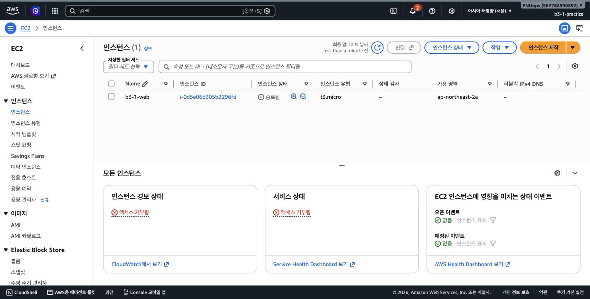
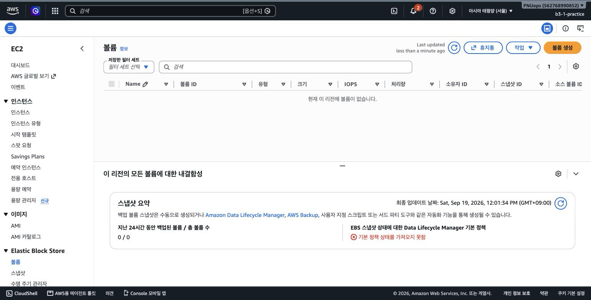
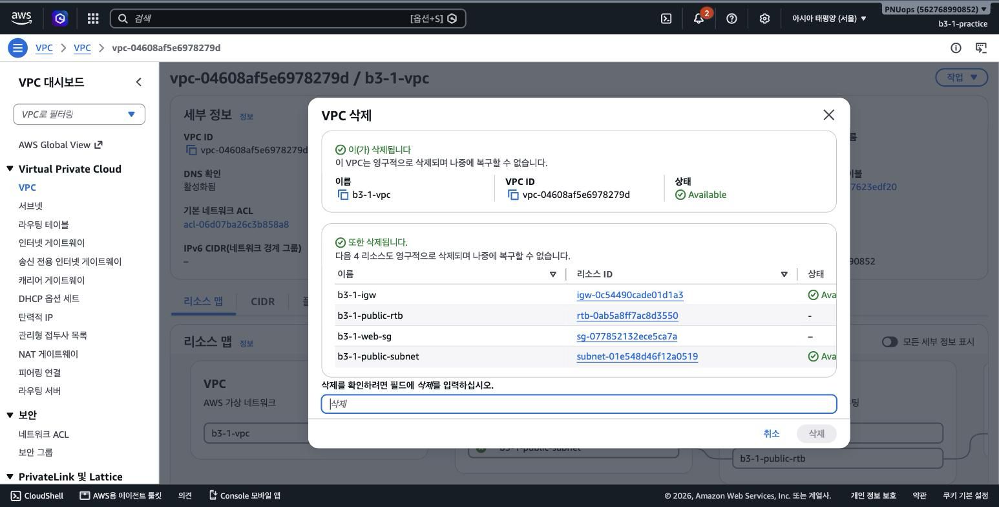
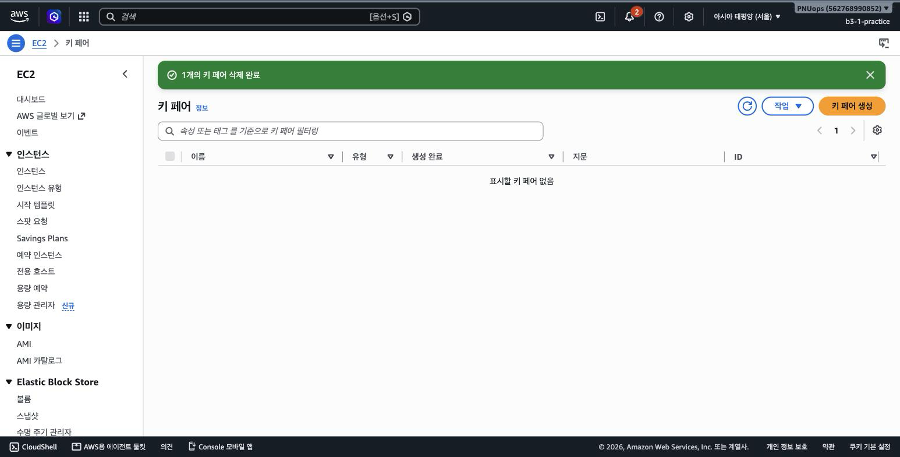
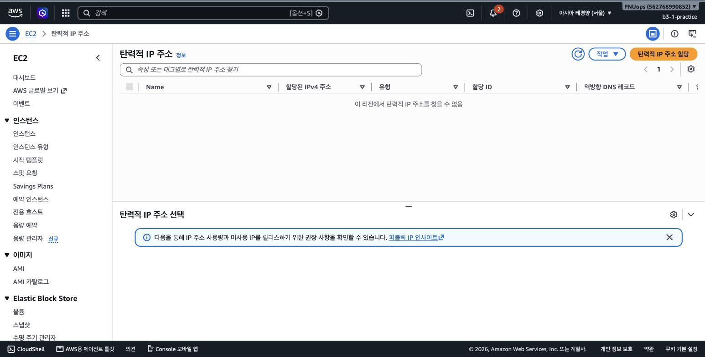

# 리소스 정리 체크리스트

실습에 만든 리소스를 모두 삭제했습니다. 항목별 확인 결과는 아래 화면과 같습니다.

| 항목 | 상태 | 확인 방법 |
|---|---|---|
| EC2 인스턴스 | 종료 완료 | 인스턴스 목록에서 상태가 종료됨 |
| EBS 볼륨 | 삭제 완료 | 인스턴스 종료 시 루트 볼륨 함께 삭제, 볼륨 목록이 비어 있음 |
| Elastic IP | 해당 없음 | 할당하지 않음, 탄력적 IP 목록이 비어 있음 |
| Internet Gateway | 삭제 완료 | VPC 삭제 시 함께 삭제 |
| VPC | 삭제 완료 | VPC 목록에 기본 VPC만 남음 |
| Subnet | 삭제 완료 | VPC 삭제 시 함께 삭제 |
| 라우팅 테이블 | 삭제 완료 | VPC 삭제 시 함께 삭제 |
| Security Group | 삭제 완료 | VPC 삭제 시 함께 삭제 |
| 키 페어 | 삭제 완료 | 키 페어 목록이 비어 있음 |
| NAT Gateway | 해당 없음 | 생성하지 않음 |
| ELB/ALB | 해당 없음 | 생성하지 않음 |
| RDS | 해당 없음 | 생성하지 않음 |

## 삭제 순서

인스턴스를 먼저 종료해야 그 인스턴스가 사용하던 네트워크 인터페이스가 풀리고, 그래야 보안 그룹과 서브넷을 지울 수 있습니다. VPC는 안에 남은 리소스가 하나도 없어야 삭제되는데, 콘솔의 VPC 삭제는 함께 지울 리소스를 먼저 보여주고 한 번에 처리합니다. 그래서 인스턴스 종료, VPC 삭제, 키 페어 삭제 순으로 진행했습니다.

## 인스턴스 종료

인스턴스 상태 메뉴에서 종료를 선택하면 루트 EBS 볼륨이 함께 삭제된다는 안내가 나옵니다. 종료 후 목록에서 상태가 종료됨으로 바뀌었습니다.

볼륨 목록이 비어 있어 루트 볼륨이 남지 않았음을 확인했습니다.

## VPC와 딸린 리소스 삭제

VPC 삭제 화면이 함께 삭제될 리소스를 보여줍니다. 인터넷 게이트웨이, 라우팅 테이블, 보안 그룹, 서브넷 네 개가 대상입니다.

삭제 후 목록에는 처음부터 있던 기본 VPC만 남았습니다.

## 키 페어 삭제

인스턴스를 지운 뒤 키 페어도 삭제했습니다.

## Elastic IP 확인

이번 실습에서는 Elastic IP를 할당하지 않고 인스턴스에 자동으로 붙는 퍼블릭 IP를 사용했습니다. 목록이 비어 있어 남은 주소가 없음을 확인했습니다.

종료된 인스턴스는 목록에 한동안 종료됨 상태로 남았다가 사라집니다. 이 상태에서는 요금이 발생하지 않습니다.
